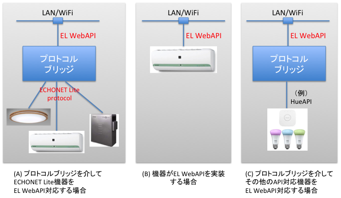

# ECHONET Lite WebAPI (EL-WebAPI) Specification

Revision History  

| Date | Version  | Description |
|:-----------|:-----|:-----|
| 2017.12.11 | version 1.0.0 |  |
| 2017.12.17 | version 1.0.1 | Device DescriptionのDataのvalueの表記をobjectからarrayに変更<br>Data Typeを修正(levelとpercentageを削除） |
| 2017.12.20 | version 1.0.2 | Data Typeを修正(levelを復活） |
| 2018.01.30 | version 1.0.3 | Data Type "key" の名前を "enum" に修正 |
| 2018.02.04 | version 1.0.4 | Typo修正　instataneous -> instantaneous |
| 2018.02.13 | version 1.0.5 | Arrayのmember名elementをdataに変更（recursive処理に対応するため） |
| 2018.03.08 | version 1.0.6 | Data type levelを廃止<br>Data type integerをnumberに統合<br>Data type numberにproperty "minimumDigit"を追加 |

## 1. Abstract
　ECHONET Lite機器をプロトコルブリッジを介してHTTP(REST)で制御するためのWebAPI（以下EL-WebAPIと呼ぶ）を提案する。このドキュメントはAPIの定義を記述する。機器毎の仕様は別ドキュメントの「ECHONET Lite WebAPI Device Description」に記述する。なおこのドキュメントはECHONET Liteの仕様を理解していることを前提としている。ECHONET Liteの仕様は、エコーネットコンソーシアムの[Web Site](https://echonet.jp/spec_g/#standard-01)から入手できる。  
　このドキュメントではWebAPI(REST)のメソッドとしてのGET, PUT, POSTとECHONET LiteのサービスとしてのGET, GET_RES, SET, INFという用語を使用する。特にGETに関しては文脈で区別がつかない場合はGET(REST), GET(EL)と表記する。また、プロパティ（Property）という用語も区別が必要なので、ECHONET Liteの場合は"エコーネットプロパティ"、WebAPIの場合はPropertyと表記する。

## 2. Basic Concept
### 2.1 システム構成
WebAPIを設計するにあたり下記(A)のシステム構成を前提とするが、(B)や(C)のシステム構成も考慮する。  

(A)プロトコルブリッジがECHONET Lite ProtocolとEL-WebAPIを変換する場合  
(B)機器がEL-WebAPIを実装する場合    
(C)プロトコルブリッジがその他のAPIとEL-WebAPIを変換する場合  


  

　ECHONET Lite機器のシステム構成に関しては、Node Profileに機器オブジェクトが１つ存在する構成だけでなく、同一オブジェクトが複数存在する構成や、複数の異なるオブジェクトが存在する構成も考慮する。

### 2.2 EL-WebAPIの設計方針

ECHONET Liteの仕様を理解していなくてもEL-WebAPIを利用して機器を制御できることを目指して以下の方針を定めた。

- RESTful APIとする
- 転送するデータはJSONとする
- ECHONET Liteのノードプロファイルの概念は利用しない
- ECHONET Liteのスーパークラスの概念は利用しない
- GET(REST)で取得した値はそのまま使えること  
    ECHONET LiteのGETコマンドで取得した値は以下のように換算が必要な場合がある。これらの換算はプロトコルブリッジが行う。
    - 例１：蓄電池　EPC=0xE3（蓄電残量２）の値は0.1倍する
    - 例２：低圧スマート電力量メータ　EPC=0xE3（積算電力量計測値）の値はEPC=0xD3（係数）とEPC=0xE1（積算電力量単位）の値を乗算する
- アトミックオペレーションをプロトコルブリッジがサポートする  
    ECHONET Liteのあるエコーネットプロパティは、GET(EL)コマンドを実行する前にSETコマンドを実行する必要がある
    - 例：低圧スマート電力量メータの積算電力量計測値履歴１（EPC=0xE2）の値をECHONET Liteで取得する場合、積算履歴収集日１（EPC=0xE5）をSETしたのちに積算電力量計測値履歴１（EPC=0xE2）をGET(EL)する必要がある。EL-WebAPIを使って積算電力量計測値履歴１に対応するPropertyをGET(REST)する場合、積算履歴収集日１の値をGET(REST)のqueryとして指定する。プロトコルブリッジはこのGET(REST)を受信すると、低圧スマートメータにEPC=0xE5のSETを送信した後にEPC=0xE2のGET(EL)を送信する。プロトコルブリッジは低圧スマートメータからGET_RESでエコーネットプロパティの値を受信するとその値をWebAPIのresponseとする。
-  W3C [Web Thing API](http://iot.mozilla.org/wot/#), [Web of Things (WoT) Thing Description](https://w3c.github.io/wot-thing-description/) を参考にする  
    - コントローラと機器のinteractionをproperty, action, eventで行う
    - 機器の仕様をJSON formatのDevice Descriptionで記述する

## 3. 簡単な実例

　照明のON/OFF状態を取得する場合と照明をONにする場合を例にしてECHONET Lite protocolとEL-WebAPIを簡単に説明する。  

### 3.1 ECHONET Lite
ECHONET Lite protocolはUDPでバイナリデータを送受信する。ECHONET Liteの電文は以下の要素で構成されている。  
> EHD: ECHONET Header(2byte)  
> TID: Transaction Id(2byte)  
> SEOJ:Source ECHONET Object:送信元の機器を指定するデータ(3byte)  
> DEOJ:Destination ECHONET Object:送信先の機器を指定するデータ(3byte)  
> ESV: ECHONET Service:コマンドの種類(GET, GET\_RES, SET\_C, SET\_RESなど)を示すデータ(1byte)  
> OPC: Operation Count:命令の個数を表すデータ(1byte)  
> EPC: ECHONET Property Code:Propertyを指定するデータ(1byte)  
> PDC: Property Data Count:EDTのデータ長(1byte)  
> EDT: ECHONET Data:Propertyのデータ(可変長)  

#### Example:照明のON/OFF状態を取得する  

```
SEND:
EHD=0x1081, TID=0x0001, SEOJ=0x05FF01(コントローラ), DEOJ=0x029001(一般照明), ESV=0x62(GET), 
OPC=0x01, EPC=0x80(Operation Status), PDC=0x00  
    1081 0001 05FF01 029001 62 01 80 00

RECEIVE:
EHD=0x1081, TID=0x0001, SEOJ=0x029001, DEOJ=0x05FF01, ESV=0x72(GET_RES), 
OPC=0x01, EPC=0x80, PDC=0x01, EDT=0x31(OFF)  
    1081 0001 029001 05FF01 72 01 80 01 31
```
#### Example:照明をONにする  
```
SEND:ESV=0x61(SET_C), EDT=0x30(on)  
    1081 0002 05FF01 029001 61 01 80 01 30
    
RECEIVE:ESV=0x71(SET_RES)  
    1081 0002 029001 05FF01 71 01 80 00
```
### 3.2 EL-WebAPI
　EL-WebAPIでは機器の状態や機能に対してPropertyというリソース(URL)を定義する。ON/OFF状態のProperty Nameは"on"とする。以下の例では、プロトコルブリッジのIP Addressは192.168.11.201、照明のDevice Idは"generalLighting_1"とする。  
  
#### Example:照明のON/OFF状態を取得する  

```
// REQUEST  
GET http://192.168.11.201/el/v1/generalLighting_1/properties/on

// RESPONSE
200 OK  
{ "on":false }
// 消灯状態
```

#### Example:照明をONにする  

```
// REQUEST  
PUT http://192.168.11.201/el/v1/generalLighting_1/properties/on
{ "on":true }

// RESPONSE
200 OK
```

## 4. Device Description

　EL-WebAPIでは機器の仕様をJSON encodingのmachine readable formatの Device Description として定義する。各機器ごとのDevice Descriptionはドキュメント「ECHONET Lite WebAPI Device Description」に記述されている。  
　EL-WebAPIを使うとプロトコルブリッジに接続されている機器が実装している機能(properties, actions, events)に関するDevice Descriptionを取得することができる。

### 4.1 全体構成
Device Descriptionの全体構成を以下に示す。

```
{
    "type":<device type>,
    "description":<device type description>,
    "properties":[ <property>, <property> ... ],
    "actions":[ <action>, <action>... ],
    "events":[ <event>, <event>... ]
}
```

| Member | Data Type<br>of JSON | Description | Example |
|:-----------|:-----|:-----|:-----|
| type | string | device の種類を示す。<br>ECHONET Liteで定義された機器オブジェクト名(EOJ)に対応する。<br>値に関しては "8. Device Types" を参照のこと。 | "generalLighting" |
| description | object |ECHONET Liteで定義された機器オブジェクトの名称。<br>日本語と英語の名称をobject型式で示す。<br>{<br>"ja":\<device object name of ECHONET Lite in Japanese>,<br>"en":\<device object name of ECHONET Lite in English> <br>} | {<br> "ja":"一般照明",<br> "en":"General Lighting"<br> } |
| properties | [object] | property object の集合 |  |
| actions | [object] | action object の集合 |  |
| events | [object] | event object の集合 |  |

### 4.2 Property object

Property objectは機器のPropertyを記述する。ECHONET LiteでGETをサポートするエコーネットプロパティに対応する。EL-WebAPIでpropertyを取得するにはGET method, 設定するにはPUT methodを使用する。property objectの構成を以下に示す。

```
{
    "name":<property name>,
    "description":<property description>,
    "writable":<writable flag>,
    "observable":<observable flag>,
    "query":<data type object>,
    "data":<data type object>
}
```

| Field | Data Type<br>of JSON | Description | Example |
|:-----------|:-----|:-----|:-----|
| name | string | EL-WebAPIで定義するproperty name | "on", "operatingMode" |
| description | object |ECHONET Liteで定義されたエコーネットプロパティの名称。<br>日本語と英語の名称をobject型式で示す。<br>{<br>"ja":\<property name of ECHONET Lite in Japanese>,<br>"en":\<property name of ECHONET Lite in English> <br>} | {<br> "ja":"動作状態", <br>"en":"Operation Status" <br>} |
| writable | boolean | 書き込みが可能か不可能かを示す<br>ECHONET LiteのSETに対応 | true, false |
| observable | boolean | 状態変化のログを参照できるか否かを示す<br>ECHONET LiteのINFに対応| true, false |
| query | object | GETでqueryが必要な場合、<br>query dataの情報をdata type object(\*1)で記述<br>詳細は5.5節を参照 |  |
| data | object | property dataの情報をdata type object(\*1)で記述 |  |

(\*1) 6. Data Type参照

### 4.3 Action object

Action object はpropertyのSETでは記述が難しい動作を記述する。例えば reboot, alarmの解除, toggleなどである。ECHONET LiteでSETのみをサポートするエコーネットプロパティに対応する。EL-WebAPIでactionを実行するにはPOST methodを使用する。action objectの構成を以下に示す。

```
{
    "name":<action name>,
    "description":<action description>
}
```

| Field | Data Type<br>of JSON | Description | Example |
|:-----------|:-----|:-----|:-----|
| name | string | EL-WebAPIで定義するaction name | "cancelAll" |
| description | object |ECHONET Liteで定義されたエコーネットプロパティの名称。<br>日本語と英語の名称をobject型式で示す。<br>{<br>"ja":\<property name of ECHONET Lite in Japanese>,<br>"en":\<property name of ECHONET Lite in English> <br>} | {<br> "ja":"一括停止設定", <br>"en":"All Stop setting" <br>} |

### 4.4 Event object

Event object は状態変化やエラー通知などの機器からの通知を記述する。ECHONET LiteでINFをサポートするエコーネットプロパティに対応する。event objectにはINFを受信したtime stampとINFの内容が記述されている。EL-WebAPIでeventを取得するにはGET methodを使用する。event objectの構成を以下に示す。

```
{
    "name":<event name>
}
```

### 4.5 Example

以下に一般照明のDevice Descriptionを例として示す。

```
{
    "type":"generalLighting",
    "description":{"ja":"一般照明", "en":"General Lighting"},
    "properties":[
        {
            "name":"on",
            "description":{ "ja":"動作状態", "en":"Operation Status" },
            "writable":true,
            "observable":true,
            "data":{
                "type":"boolean",
                "values":[
                    {"value":true, "ja":"ON", "en":"ON"}, 
                    {"value":false, "ja":"OFF", "en":"OFF"}
                ]
            }
        },
        {
            "name":"isAtFault",
            "description":{ "ja":"異常発生状態", "en":"Fault Status" },
            "writable":false,
            "observable":true,
            "data":{
                "type":"boolean",
                "value":[
                    {"value":true, "ja":"異常あり", "en":"Fault"},
                    {"value":false, "ja":"異常無し", "en":"No Fault"}
                ]
            }
        },
        {
            "name":"brightness",
            "description":{ "ja":"照度レベル設定", "en":"Illuminance Level" },
            "writable":true,
            "observable":false,
            "data":{
                "type":"number",
                "unit":"%",
                "minimum":0,
                "maximum":100
            }
        },
        {
            "name":"operatingMode",
            "description":{ "ja":"点灯モード設定", "en":"Lighting Mode Setting" },
            "writable":true, 
            "observable":false,
            "data":{
                "type":"enum",
                "values":[
                    {"value":"auto", "ja":"自動灯", "en":"Automatic Lighting"},
                    {"value":"normal", "ja":"通常灯", "en":"Normal Lighting"},
                    {"value":"night", "ja":"常夜灯", "en":"Night Lighting"},
                    {"value":"color", "ja":"カラー灯", "en":"Color Lighting"}
                ]
            }
        },
        {
            "name":"rgb",
            "description":{ "ja":"カラー灯モード時RGB設定", "en":"RGB Setting for Color Lighting" },
            "writable":true,
            "observable":false,
            "data":{
                "type":"object",
                "field":[
                    {
                        "name":"r",
                        "description":{ "ja":"赤", "en":"Red" },
                        "data":{
                            "type":"number",
                            "unit":null,
                            "minimum":0,
                            "maximum":255
                        }
                    },
                    {
                        "name":"g",
                        "description":{ "ja":"緑", "en":"Green" },
                        "data":{
                            "type":"number",
                            "unit":null,
                            "minimum":0,
                            "maximum":255
                        }
                    },
                    {
                        "name":"b",
                        "description":{ "ja":"青", "en":"Blue" },
                        "data":{
                            "type":"number",
                            "unit":null,
                            "minimum":0,
                            "maximum":255
                        }
                    }
                ]
            }
        }
    ],
    "actions":[],
    "events":[
        { "name":"on" },
        { "name":"isAtFault" }
    ]
}
```

## 5. EL-WebAPI

ECHONET Lite WebAPI を説明する。

###List

- GET /el  
- GET /el/\<VersionId>  
- GET /el/\<VersionId>/\<DeviceId>  
- GET /el/\<VersionId>/\<DeviceId>/properties  
- GET /el/\<VersionId>/\<DeviceId>/properties/\<PropertyName>?\<Query>  
- PUT /el/\<VersionId>/\<DeviceId>/properties/\<PropertyName>  
- POST /el/\<VersionId>/\<DeviceId>/actions  
- GET /el/\<VersionId>/\<DeviceId>/events

### 5.1 GET /el

- DESCRIPTION  
プロトコルブリッジがサポートしているEL-WebAPIのバージョンを取得する。 

    ```
    // REQUEST
    GET /el
    
    // RESPONSE
    200 OK
    {
        "version":[<version>] 
    }
    ```
    
- Example  

    ```
    // REQUEST
    GET http://192.168.50.11/el

    // RESPONSE
    200 OK
    {
        "version" :[v1, v2]
    }
    ```

### 5.2 GET /el/\<VersionId>

- DESCRIPTION  
プロトコルブリッジに接続されている機器リスト（DeviceIdと付加情報）を取得する。  

    ```
    // REQUEST
    GET /el/<VersionId>

    // RESPONSE
    200 OK
    [
        {
            "id":<deviceId>,
            "type":<deviceType>,
            "ip":<ip_address>,
            "protocol":{
                "type":<protocolType>,
                "version:<version>
                },
            "manufacturer":{
                "code":<manufacturerCode>,
                "description":{ "ja":<Manufacturer Name(日本語)>, "en":<Manufacturer Name(英語)> } 
                }
        },
        ...
    ]
    ```

    | Field | Data Type of<br>JSON | Description | Example |
    |:-----------|:-----|:-----|:-----|
    | id | String |機器を指定するためのDevice Id<br>プロトコルブリッジが決めるユニークな値 | "generalLighting_01"(*1) |
    | type | String |Device Type | "generalLighting" |
    | ip | String | DeviceのIP Address |  "192.168.128.11" |
    | protocol.type | String | 機器制御Protocolの種類 | "ECHONET\_Lite" |
    | protocol.version | String | 機器制御ProtocolのVersion<br>ECHONET Liteの場合は規格Version<br>(EPC=0x82)の値をdecodeしたもの | "D" |
    | manufacturer.code | String | メーカーコード<br>ECHONET Liteの場合はEPC=0x8Aの値| "0x000077" |
    | manufacturer.description | String | メーカー名| {<br>"ja":"神奈川工科大学",<br>"en":"Kanagawa Institute of<br> Technology"<br>} |    

    (\*1) 以下の例では\<deviceName>_\<index>を利用しているが、UUIDなどユニークな値であれば構わない。


- Example  

    ```
    // REQUEST
    GET http://192.168.50.11/el/v1

    // RESPONSE
    200 OK
    [
        {
            "id":"generalLighting_1",
            "type":"generalLighting",
            "ip":"192.168.50.5",
            "protocol":{ "type":"ECHONET_Lite", "version":"G"},
            "manufacturer" :{
                "code":"0x000077", 
                "description":{ "ja":"神奈川工科大学", "en":"Kanagawa Institute of Technology"}
            }
        },
        {
            "id":"generalLighting_2",
            "type":"generalLighting",
            "ip":"192.168.50.6",
            "protocol":{ "type":"ECHONET_Lite", "version":"I"},
            "manufacturer" :{
                "code":"0x00001B", 
                "description":{ "ja":"東芝ライテック", "en":"Toshiba Lighting & Technology Co."}
            }
        },
        {
            "id":"generalLighting_3",
            "type":"generalLighting",
            "ip":"192.168.50.7",
            "protocol":{ "type":"HUE", "version":null},
            "manufacturer" :{
                "description":{ "ja":"フィリップス", "en":"Philips"}
            }
        },
        {
            "id":"homeAirConditioner_1",
            "type":"homeAirConditioner",
            "ip":"192.168.50.8",
            "protocol":{ "type":"ECHONET_Lite", "version":"H"},
            "manufacturer" :{
                "code":"0x00000B", 
                "description":{ "ja":"パナソニック", "en":"Panasonic"}
            }
        }
    ]
    ```


### 5.3 GET /el/\<VersionId>/\<DeviceId>
- DESCRIPTION  
DeviceIdで指定した機器の Device Description を取得する。Properties, Actions, Eventsの各項目は機器が実際に実装している項目の情報を取得できる。Device Description に関しては "4 Device Description" を参照のこと。

    ```
    // REQUEST
    GET /el/<VersionId>/<DeviceId>
    
    // RESPONSE
    200 OK
    <device description>
    
    ```
    
- Example  

    ```
    // REQUEST
    GET http://192.168.50.11/el/v1/generalLighting_1

    // RESPONSE
    200 OK
	{
	    "type":"generalLighting",
	    "description":{"ja":"一般照明", "en":"General Lighting"},
	    "properties":[
	        {
	            "name":"on",
	            "description":{ "ja":"動作状態", "en":"Operation Status" },
	            "writable":true,
	            "observable":true,
	            "data":{
	                "type":"boolean",
	                "values":[
	                    {"value":true, "ja":"ON", "en":"ON"}, 
	                    {"value":false, "ja":"OFF", "en":"OFF"}
	                ]
	            }
	        },
	        <以下省略>
    ```
    
### 5.4 GET /el/\<VersionId>/\<DeviceId>/properties
- DESCRIPTION  
    DeviceIdで指定した機器の全てのPropertyについて値を取得する。  
    Propertyの値はプロトコルブリッジがキャッシュしている値なので最新の値とは限らない。最新の値はpropertyを個別に指定して取得できる。5.5節参照のこと。  
    プロトコルブリッジは以下のタイミングでキャッシュを更新する。
    - プロトコルブリッジの起動時
    - プロトコルブリッジが初期化コマンドを受信した場合
    - GET /el/\<VersionId>/\<DeviceId>/properties/\<PropertyName> を実行した場合
    - PUT /el/\<VersionId>/\<DeviceId>/properties/\<PropertyName> を実行した場合  
        （プロトコルブリッジはSET(EL)を実行した後、自動でGET(EL)を実行する） 
    - 機器からINF(EL)を受信した場合  

    ```
    // REQUEST 
    GET /el/<VersionId>/<DeviceId>/properties
    
    // RESPONSE
    200 OK
    {
        <propertyName>:<propertyValue>,
        <propertyName>:<propertyValue>
        ...
    }
    ```

- Example  

    ```
    // REQUEST
    GET http://192.168.50.11/el/v1/generalLighting_1/properties

    // RESPONSE
    200 OK
    {
        "on":true,
        "isAtFault":false,
        "brightness":50,
        "operatingMode":"color",
        "rgb":{ "r":20, "g":255, "b":0 }
    }
    ```

### 5.5 GET /el/\<VersionId>/\<DeviceId>/properties/\<PropertyName>?\<Query>  

- DESCRIPTION  
指定したpropertyの値を取得する。  
- Query  
通常は不要。スマートメーターなど一部の機器の特定のpropertyでSET(EL)とGET(EL)のatomic operationが必要な場合にSETのdataを指定するためにQueryを利用する。keyはproperty毎に定義する。  

    ```
    // REQUEST
    GET /el/<VersionId>/<DeviceId>/properties/<PropertyName>?<Query>
    
    // RESPONSE
    200 OK
    { <propertyName>:<data> }

    or
    
    // RESPONSEがobjectの場合
    200 OK
    {
        <propertyName>:{
            <elementName>:<data> }, 
            <elementName>:<data> }, 
            ...
        }
    }
    ```

- Example  

    ```
    // REQUEST
    GET http://192.168.50.11/el/v1/generalLighting_1/properties/operatingMode

    // RESPONSE
    200 OK
    { "operatingMode":"color" }
    ```

    ```
    // REQUEST
    GET http://192.168.50.11/el/v1/generalLighting_1/properties/rgb

    // RESPONSEがobjectの場合
    200 OK
    {
        "rgb":{
            "r":20 },
            "g":255},
            "b":0  }
        }
    }
    ```

    ```
    // REQUESTにqueryがある場合
    http://192.168.50.11/el/v1/lvSmartelectricEnergyMeter_1/properties/normDirIntegralEnergyLog1?day=0

    // RESPONSE
    200 OK
    {
        "normDirIntegralEnergyLog1":{
            "day":0,
            "energy":[20, 34, 59, 109] 
        }
    }
    ```

### 5.6 PUT /el/\<VersionId>/\<DeviceId>/properties/\<PropertyName>  

- DESCRIPTION  
指定したpropertyの値を設定する  

    ```
    // REQUEST
    PUT /el/<VersionId>/<DeviceId>/properties/<PropertyName>
    { <propertyName>:<data> }
    
    // RESPONSE
    200 OK
    ```

- Example  

    ```
    // REQUEST
    PUT http://192.168.50.11/el/v1/generalLighting_1/properties/operatingMode
    { "operatingMode":"color" }
    
    //RESPONSE
    200 OK
    ```

    ```
    // REQUEST
    PUT http://192.168.50.11/el/v1/generalLighting_1/properties/rgb
    { "rgb":{ "r":100, "g":255, "b":20 } }
    
    //RESPONSE
    200 OK
    ```

### 5.7 POST /el/\<VersionId>/\<DeviceId>/actions

- DESCRIPTION  
actionの実行をリクエストする  

    ```
    // REQUEST
    POST /el/<VersionId>/<DeviceId>/actions
    { "name":<action> }
    
    // RESPONSE
    200 OK
    ```

- Example  

    ```
    // REQUEST
    POST http://192.168.50.11/el/v1/cookingHeater_1/actions
    { "name":"cancelAll" }
    
    //RESPONSE
    200 OK
    ```

### 5.8 GET /el/\<VersionId>/\<DeviceId>/events

- DESCRIPTION  
指定したdeviceのeventsを取得する  

    ```
    // REQUEST
    GET /el/<VersionId>/<DeviceId>/events
    
    // RESPONSE
    200 OK
    [
        {
            "time":<time>,
            "name":<propertyName>,
            "value":<value>
        },
        ...
    ]
    ```

- Example  

    ```
    // REQUEST
    GET http://192.168.50.11/el/v1/generalLighting_1/events
    
    // RESPONSE
    200 OK
    [
        {
            "time":"2017-01-24T13:02:45+09:00"
            "name":"on",
            "value":true,
        },
        {
            "time":"2017-01-24T13:15:22+09:00"
            "name":"on",
            "value":false,
        },
        ...
    ]
    ```


## 6. Data Type Object  
### 6.1 Definition of Data Type
EL-WebAPIで取得または設定するProperty値の data type を以下のように定義する。  

- Simple Data: boolean, enum, number, integer, date
- Structured Data: array, object

| Data Type<br>of WebAPI | Data Type<br>of JSON |Description | Member of<br>Device Description | 
|:-----------|:-----|:-----|:-----|
| boolean | boolean |true または false の２値をとるデータ型 | values | 
| enum | string |状態を表すkeyword | values | 
| number | number<br>string(\*) |数値 | unit<br>minimum<br>maximum<br>minimumDigit<br>alternatives(\*) | 
| level | number<br>string(\*) | 強弱のレベルを表す整数値<br>1が弱、最大レベルは"maximum"で定義する | maximum<br>alternatives(\*) |
| date | string|日時を表すdata type。ISO8601準拠。<br>"yyyy-MM-ddThh:mm:ss+\<time zone>"のformat<br>例："2017-01-24T13:15:22+09:00" || 
| array |  [ ] |同一data typeの要素の配列 | data |
| object |  { } |複数の要素から構成されるデータ | field |

(\*)定義されたdata type以外にkeyのdata typeも扱う場合に利用するmember。例えばlevelのdata typeで1...maximumの整数値の他に"auto"という値も扱う場合など

### 6.2 Description of Data Type Object
#### 6.2.1 boolean
Format

```
{
    "type":"boolean",
    "values":[
        {"value":true,  "ja":<description in Japanese>, "en":<description in English>},
        {"value":false, "ja":<description in Japanese>, "en":<description in English>}
    ]
}
```

| Property | Type |Required |Description |  Example |
|:-----------|:-----|:-----|:-----|:-----|
| type   | string |Yes| "boolean"||
| values | array |Yes|value objectの配列||

Format of value object

```
{
    "value":<true or false>,
    "ja":<description in Japanese>,
    "en":<description in English>}
}
```

| Property | Type |Required |Description |  Example |
|:-----------|:-----|:-----|:-----|:-----|
| value | boolean |Yes| true or false| true|
| ja | string |Yes| description in Japanese| "異常あり"|
| en | string |Yes| description in Japanese| "Fault"|

Example of Device Description  
    
```
{
    "type":"boolean",
    "values":[
        {"value":true, "ja":"異常あり", "en":"Fault"},
        {"value":false, "ja":"異常無し", "en":"No Fault"}
    ]
}
```

Example of body data  
    
```
{ "on":true }, { "on":false }
```

#### 6.2.2 enum
Format

```
{
    "type":"boolean",
    "values":[
        {"value":true,  "ja":<description in Japanese>, "en":<description in English>},
        {"value":false, "ja":<description in Japanese>, "en":<description in English>}
    ]
}
```

| Property | Type |Required |Description |  Example |
|:-----------|:-----|:-----|:-----|:-----|
| type   | string |Yes| "boolean"||
| values | array |Yes|value objectの配列||

Example of Device Description  
    
```
{
    "type":"enum",
    "values":[
        {"value":"normal", "ja":"通常灯", "en":"Normal Lighting"},
        {"value":"night", "ja":"常夜灯", "en":"Night Lighting"},
        {"value":"color", "ja":"カラー灯", "en":"Color Lighting"}
    ]
}
```
Example of body data  
    
```
{ "operatingMode":"normal" }, { "operatingMode":"color" }  
```

#### 6.2.3  number
Format of Device Description

```
{
    "type":"number",
    "unit":<unit>,
    "minimum":<minimum number>,
    "maximum":<maximum number>,
    "minimumDigit":<minimum digit>
    "alternatives":[
        {"value":<value>, "ja":<description in Japanese>, "en":<description in English>},
        {"value":<value>, "ja":<description in Japanese>, "en":<description in English>},
        ...
    ]
}
```

| Property | Type |Required |Description |  Example |
|:-----------|:-----|:-----|:-----|:-----|
| type | string |Yes| "number" | |
| unit | string |No|単位 | % |
| minimum | number |No|最小値 |
| maximum | number |No|最大値 |
| minimumDigit | number |No| 最小桁<br>defaultは1で、この場合は整数を意味する |0.1|
| alternatives | array |No|value objectの配列<br>数値ではなく状態を示す場合 ||

Example of Device Description  

```
{
    "type":"number",
    "unit":"kWh",
    "minimum":0,
    "maximum":9999
}
```

Example of body data  

```
{ "humidity":45 }, { "integralEnergy":15.5 }, { "airFlowLevel":"auto" }
```

#### 6.2.4 date  
Format of Device Description

```
{
    "type":"date"
}
```

Example of Device Description  

```
{
    "type":"date"
}
```

Example of body data  

```
{ "date" :"2017-01-24T13:15:22+09:00" }
```

#### 6.2.5 array
Format of Device Description

```
{
    "type":"array",
    "data":<data type object>
}
```

| Property | Type |Required |Description |  Example |
|:-----------|:-----|:-----|:-----|:-----|
| type | string |Yes| array | 
| data | object |Yes| 配列の要素をdata type objectで表現 | 

Example of Device Description  

```
{
    "type":"array",
    "data":{
        "type":"number",
        "unit":"kWh"
        "minimum":0,
        "maximum":9999
    }
}
```

Example of body data  

```
{ "powerConsumption":[23, 12, 0,...] }
```

#### 6.2.6 object
Format of Device Description

```
{
    "type":"object",
    "field":[
        {
            "name":<element name>,
            "description":<element description>,
            "data":<data type object>
        },
        ...
    ]
}
```

| Property | Type |Required |Description |  Example |
|:-----------|:-----|:-----|:-----|:-----|
| field | array |Yes|data type objectの配列 | 

Example of Device Description (1)  

```
{
    "type":"object",
    "field":[
        {
            "name":"r",
            "description":{ "ja":"赤", "en":"Red" },
            "data":{
                "type":"number",
                "minimum":0,
                "maximum":255
            }
        },
        {
            "name":"g",
            "description":{ "ja":"緑", "en":"Green" },
            "data":{
                "type":"number",
                "minimum":0,
                "maximum":255
            }
        },
        {
            "name":"b",
            "description":{ "ja":"青", "en":"Blue" },
            "data":{
                "type":"number",
                "minimum":0,
                "maximum":255
            }
        }
    ]
}
```

Example of body data (1)  

```
{
    "rgb":{
        "r":20 },
        "g":255},
        "b":0  }
    }
}
```

Example of Device Description (2)  

```
"type":"object",
"field":[
    {
        "name":"day",
        "description":{ "ja":"日", "en":"day" },
        "data":{
            "type":"number",
            "minimum":0,
            "maximum":255
        }
    },
    {
        "name":"energy",
        "description":{ "ja":"消費電力量", "en":"consumed energy" },
        "data":{
            "type":"array"
            "data":{
                "type":"number",
                "unit":kWh
            }
        }
    },
]
```

Example of body data (2)  

```
{
    "normDirIntegralEnergyLog1":{
        "day":0,
        "energy":[20, 34, 59, 109] 
    }
}
```

## 7. ERROR処理
ERRORが発生した場合は、Status Codeを "400" とする。  
ERROR時のRESPONSEは以下のとおり。  

```
// RESPONSE
400 Error
{
    "type":<ErrorType>,
    "message":<ErrorMessage>
}   
```
| member | Data Type of JSON |Description | 
|:-----------|:-----|:-----|
| type | string | ErrorのTypeを示す。<br>プロトコルブリッジがErrorと判断する場合（rangeError, referenceError, typeError, timeout）と機器がエラーと判断する場合（deviceError）がある。 | 
| message | string | ERRORの詳細を記述する任意のString data | 

- ErrorType  

    | ErrorType | Description | Example |
    |:------|:------------|:------------|
    | rangeError | 設定する値が仕様の範囲外の場合 | number, integer:値がminとmaxの間にない場合<br>enum:値が存在しない場合 |
    | referenceError | 設定するdeviceNameやpropertyNameが存在しない場合 |  |
    | typeError | 設定する値の型がDevice Descriptionに記述された型と一致しない場合 |  |
    | timeout | 機器から一定時間内に返答がない場合 |  |
    | deviceError | 機器から受信したデータがerrorに対応する値の場合<br>機器からSNAを受信した場合 | 0xFFFEがOverflowを意味する場合<br>GET\_SNA, SET\_SNAを受信した場合 |

####Examples  

```
{ "type":"rangeError", "message":"data is out of range" }
{ "type":"rangeError", "message":"no value matches to the data" }

{ "type":"referenceError", "message":"deviceName is wrong" }   
{ "type":'referenceError", "message":"propertyName is wrong" }   

{ "type":"typeError", "message":"data should be boolean" }   

{ "type":"timeoutError", "message":"timeout !" }   

{ "type":"deviceError", "message":"overflow" }   
{ "type":"deviceError", "message":"undefined" }   
{ "type":"deviceError", "message":"GET_SNA" }   
```


## 8. Device Types  
　ECHONET Liteの仕様書（ECHONET 機器オブジェクト詳細規定　Release I）に記載されている機器オブジェクト名とEL-WebAPIのdeviceTypeの対応を以下に示す。deviceTypeはECHONET Liteの英語の機器オブジェクト名を参照して定義した。機器オブジェクト名が赤字のものは重点８機器である。

| EL:EOJ | EL:機器オブジェクト名(ja) | EL:Device Object Name(en) | EL-WebAPI:deviceType|
|:------:|:------------:|:------------:|:------------:|
| 0x0001 | ガス漏れセンサ | gas leak sensor | gasLeakSensor |
| 0x0002 | 防犯センサ | crime prevention sensor | crimePreventionSensor |
| 0x0003 | 非常ボタン | emergency button | emergencyButton |
| 0x0004 | 救急用センサ | first aid sensor | firstAidSensor |
| 0x0005 | 地震センサ | earthquake sensor | earthquakeSensor |
| 0x0006 | 漏電センサ | electric leak sensor | electricLeakSensor |
| 0x0007 | 人体検知センサ | human detection sensor | humanDetectionSensor |
| 0x0008 | 来客センサ | visitor sensor | visitorSensor |
| 0x0009 | 呼び出しセンサ | call sensor | callSensor |
| 0x000A | 結露センサ | condensation sensor | condensationSensor |
| 0x000B | 空気汚染センサ | air pollution sensor | airPollutionSensor |
| 0x000C | 酸素センサ | oxygen sensor | oxygenSensor |
| 0x000D | 照度センサ | illuminance sensor | IlluminanceSensor |
| 0x000E | 音センサ | sound sensor | soundSensor |
| 0x000F | 投函センサ | mailing sensor | mailingSensor |
| 0x0010 | 重荷センサ | weight sensor | weightSensor |
| 0x0011 | 温度センサ | temperature sensor | temperatureSensor |
| 0x0012 | 湿度センサ | humidity sensor | humiditySensor |
| 0x0013 | 雨センサ | rain sensor | rainSensor |
| 0x0014 | 水位センサ | water level sensor | waterLevelSensor |
| 0x0015 | 風呂水位センサ | bath water level sensor | bathWaterLevelSensor |
| 0x0016 | 風呂沸き上がりセンサ | bath heating status sensor | bathHeatingStatusSensor |
| 0x0017 | 水漏れセンサ | water leak sensor | waterLeakSensor |
| 0x0018 | 水あふれセンサ | water overflow sensor | waterOverflowSensor |
| 0x0019 | 火災センサ | fire sensor | fireSensor |
| 0x001A | タバコ煙センサ | cigarette smoke sensor | cigaretteSmokeSensor |
| 0x001B | ＣＯ２センサ | CO2 sensor | co2Sensor |
| 0x001C | ガスセンサ | gas sensor | gasSensor |
| 0x001D | ＶＯＣセンサ | VOC sensor | vocSensor |
| 0x001E | 差圧センサ | differential pressure sensor | differentialPressureSensor |
| 0x001F | 風速センサ | air speed sensor | airSpeedSensor |
| 0x0020 | 臭いセンサ | odor sensor | OdorSensor |
| 0x0021 | 炎センサ | flame sensor | flameSensor |
| 0x0022 | 電力量センサ | electric energy sensor | electricEnergySensor |
| 0x0023 | 電流値センサ | current value sensor | currentValueSensor |
| 0x0025 | 水流量センサ | water flow rate sensor | waterFlowRateSensor |
| 0x0026 | 微動センサ | micromotion sensor | micromotionSensor |
| 0x0027 | 通過センサ | passage sensor | passageSensor |
| 0x0028 | 在床センサ | bed presence sensor | bedPresenceSensor |
| 0x0029 | 開閉センサ | open/close sensor | openCloseSensor |
| 0x002A | 活動量センサ | activity amount sensor | activityAmountSensor |
| 0x002B | 人体位置センサ | human body location sensor | humanBodyLocationSensor |
| 0x002C | 雪センサ | snow sensor | snowSensor |
| 0x002D | 気圧センサ | air pressure sensor | airPressureSensor |
| 0x0130 | <font color="Red">家庭用エアコン | home air conditioner | homeAirConditioner |
| 0x0133 | 換気扇 | ventilation fan | ventilationFan |
| 0x0134 | 空調換気扇 | air conditioner ventilation fan | AirConditionerVentilationFan |
| 0x0135 | 空気清浄器 | air cleaner | airCleaner |
| 0x0139 | 加湿器 | humidifier | humidifier |
| 0x0142 | 電気暖房器 | electric heater | electricHeater |
| 0x0143 | ファンヒータ | fan heater | fanHeater |
| 0x0155 | 電気蓄熱暖房器 | electric storage heater | electricStorageHeater |
| 0x0156 | 業務用パッケージエアコン室内機 (設備用除く)クラス | package-type commercial air conditioner indoor unit | commercialAirConditionerIndoorUnit |
| 0x0157 | 業務用パッケージエアコン室外機 (設備用除く)クラス | package-type commercial air conditioner outdoor unit | commercialAirConditionerOutdoorUnit | 
| 0x0260 | 電動ブラインド・日よけ | electrically operated blind/shade | electricBlind |
| 0x0261 | 電動シャッター | electrically operated shutter | electricShutter |
| 0x0263 | 電動雨戸・シャッター | electrically operated rain sliding door/shutter | electricRainDoor |
| 0x0264 | 電動ゲート | electrically operated gate | electricGate |
| 0x0265 | 電動窓 | electrically operated window | electricWindow |
| 0x0266 | 電動玄関ドア・引戸 | electrically operated entrance door/sliding door | electricDoor |
| 0x0267 | 散水器（庭用） | sprinkler (for garden) | sprinkler |
| 0x026B | <font color="Red">電気温水器</font> | electric water heater | electricWaterHeater |
| 0x026E | 電気便座 | electric toilet seat | electricToiletSeat |
| 0x026F | 電気錠 | electric key | electricKey |
| 0x0272 | <font color="Red">瞬間式給湯器</font> | instantaneous water heater | instantaneousWaterHeater |
| 0x0273 | 浴室暖房乾燥機 | bathroom heater and dryer | bathroomHeaterDryer |
| 0x0279 | <font color="Red">住宅用太陽光発電</font> | household solar power generation | pvPowerGeneration |
| 0x027A | 冷温水熱源機 | cold or hot water heat source equipment | coldHotWaterHeatSourceEquipment |
| 0x027B | 床暖房 | floor heater | floorHeater |
| 0x027C | <font color="Red">燃料電池</font> | fuel cell | fuelCell |
| 0x027D | <font color="Red">蓄電池</font> | storage battery | storageBattery |
| 0x027E | <font color="Red">電気自動車充放電器</font> | electric vehicle charger/discharger | evChargerDischarger |
| 0x027F | エンジンコージェネレーション | engine cogeneration | engineCogeneration |
| 0x0280 | 電力量メータ | watt-hour meter | wattHourMeter |
| 0x0281 | 水流量メータ | water flow meter | waterFlowMeter |
| 0x0282 | ガスメータ | gas meter | gasMeter |
| 0x0283 | LPガスメータ | LP gas meter | lpGasMeter |
| 0x0287 | 分電盤メータリング | power distribution board metering | powerDistributionBoardMetering |
| 0x0288 | <font color="Red">低圧スマート電力量メータ</font> | low-voltage smart electric energy meter | lvSmartelectricEnergyMeter |
| 0x0289 | スマートガスメータ | smart gas meter | smartGasMeter |
| 0x028A | <font color="Red">高圧スマート電力量メータ</font> | high-voltage smart electric energy meter | hvSmartelectricEnergyMeter |
| 0x028B | 灯油メータクラス | kerosene meter | keroseneMeter |
| 0x028C | スマート灯油メータクラス | smart kerosene meter | smartKeroseneMeter |
| 0x0290 | <font color="Red">一般照明</font> | general lighting | generalLighting |
| 0x0291 | 単機能照明 | mono functional lighting | monoFunctionalLighting |
| 0x02A0 | ブザー | buzzer | buzzer |
| 0x02A1 | 電気自動車充電器 | electric vehicle charger | evCharger |
| 0x02A2 | Household small wind turbine power generation | Household small wind turbine power generation | householdSmallWindTurbinePowerGeneration |
| 0x02A3 | 照明システムクラス | lighting system | lightingSystem |
| 0x03B2 | 電気ポット | electric hot water pot | electricHotWaterPot |
| 0x03B7 | 冷凍冷蔵庫 | refrigerator | refrigerator |
| 0x03B8 | オーブンレンジ | combination microwave oven | combinationMicrowaveOven |
| 0x03B9 | クッキングヒータ | cooking heater | cookingHeater |
| 0x03BB | 炊飯器 | rice cooker | riceCooker |
| 0x03C5 | 洗濯機 | washing machine | washingMachine |
| 0x03C6 | 衣類乾燥機 | clothes dryer | clothesDryer |
| 0x03CE | 業務用ショーケース | commercial show case | commercialShowCase |
| 0x03D3 | 洗濯乾燥機 | washer and dryer | washerDryer |
| 0x03D4 | 業務用ショーケース向け室外機 | commercial show case outdoor unit | commercialShowCaseOutdoorUnit |
| 0x0401 | 体重計 | weighing machine | WeighingMachine |
| 0x05FA | 並列処理併用型電力制御クラス | parallel processing combination-type power | parallelProcessingCombinationTypePower |
| 0x05FB | DRイベントコントローラ | DR event controller | drEventController |
| 0x05FD | スイッチ（JEMA/HA端子対応） | switch | switch |
| 0x05FF | コントローラ | controller | controller |
| 0x0601 | ディスプレー | display | display |
| 0x0602 | テレビ | television | television |
| 0x0603 | オーディオ | audio | audio |
| 0x0604 | ネットワークカメラ | network camera | networkCamera |

